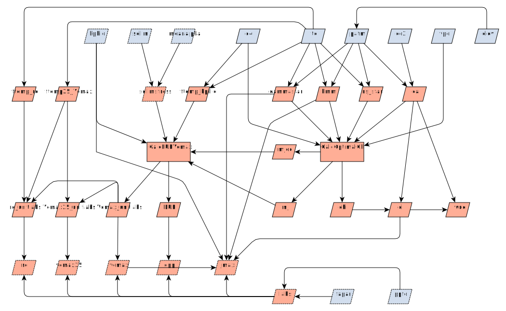

---
jupytext:
  formats: md:myst
  text_representation:
    extension: .md
    format_name: myst
kernelspec:
  display_name: Python 3
  language: python
  name: python3
---

# The P-Model

This module provides a Python implementation of the P-model
(:{cite}`Prentice:2014bc`, :{cite}`Wang:2017go`). It is based very heavily on
the `rpmodel` implementation of the model ({cite}`Stocker:2020dh`) but has some
differences (see [here](rpmodel) for discussion).
 
## Overview

The P-model uses the the following four core environmental variables to build a
model of carbon capture and water use:

- temperature (`tc`),
- vapor pressure deficit (`vpd`),
- atmospheric CO2 concentration (`co2`), and
- atmospheric pressure (`patm`)

If atmospheric pressure is not available then it can be calculated from
elevation (`elv`). From these core variables, the P-model follows four broad
steps to predict photosynthetic efficiencies and capacity. These are:

1. Calculation of environmentally determined photosynthetic parameters
   ([Details](optimal_chi#photosynthetic-parameters)).
2. Calculation of the optimal ratio of internal to ambient $\ce{CO2}$ partial
   pressure ([Details](optimal_chi#calculation-of-optimal-chi)) 
3. Calculation of light use efficiency and maximum carboxylation capacity
   ([Details](lue_vcmax)). This provides options to include:

   * limitation of the maximum rate of rubisco regeneration ($J_{max}$),
   * temperature sensitivity of the intrinsic quantum yield of
     photosynthesis ($\phi_0$), and
   * soil moisture stress.

4. All of the P model calculations are calculated as values per unit absorbed
   light. If the user provides estimates of the fraction of absorbed
   photosynthetically active radiation (`fapar`, FAPAR) and the photosynthetic
   photon flux density (`ppfd`, PPFD), then these are scaled to give absolute
   values of key variables ([Details](iabs_scaling)).

## P-model variable graph

The graph below shows the model inputs (blue) and internal variables (red) used
in the P-model. Optional inputs and internal variables are shown with a dashed
edge.

        - `iwue`: Intrinsic water use efficiency (iWUE, Pa), calculated as
                               \deqn{
                                     iWUE = ca (1-\chi)/(1.6)
                               }
        - `gs`: Stomatal conductance (gs, in mol C m-2 Pa-1), calculated as
                               \deqn{
                                    gs = A / (ca (1-\chi))
                               }
                               where \eqn{A} is \code{gpp}\eqn{/Mc}.
        - `vcmax`: Maximum carboxylation capacity \eqn{Vcmax} (mol C m-2) at growth temperature (argument
                              \code{tc}), calculated as
                              \deqn{
                                   Vcmax = \phi(T) \phi0 Iabs n
                              }
                              where \eqn{n} is given by \eqn{n=m'/mc}.
        - `vcmax25`: Maximum carboxylation capacity \eqn{Vcmax} (mol C m-2) normalised to 25 deg C
                             following a modified Arrhenius equation, calculated as \eqn{Vcmax25 = Vcmax / fv},
                             where \eqn{fv} is the instantaneous temperature response by Vcmax and is implemented
                             by function \link{calc_ftemp_inst_vcmax}.
        - `jmax`: The maximum rate of RuBP regeneration () at growth temperature (argument
                              \code{tc}), calculated using
                              \deqn{
                                   A_J = A_C
                              }
        - `rd`: Dark respiration \eqn{Rd} (mol C m-2), calculated as
                             \deqn{
                                 Rd = b0 Vcmax (fr / fv)
                             }
                             where \eqn{b0} is a constant and set to 0.015 (Atkin et al., 2015), \eqn{fv} is the
                             instantaneous temperature response by Vcmax and is implemented by function
                             \link{calc_ftemp_inst_vcmax}, and \eqn{fr} is the instantaneous temperature response
                             of dark respiration following Heskel et al. (2016) and is implemented by function
                             \link{calc_ftemp_inst_rd}.

